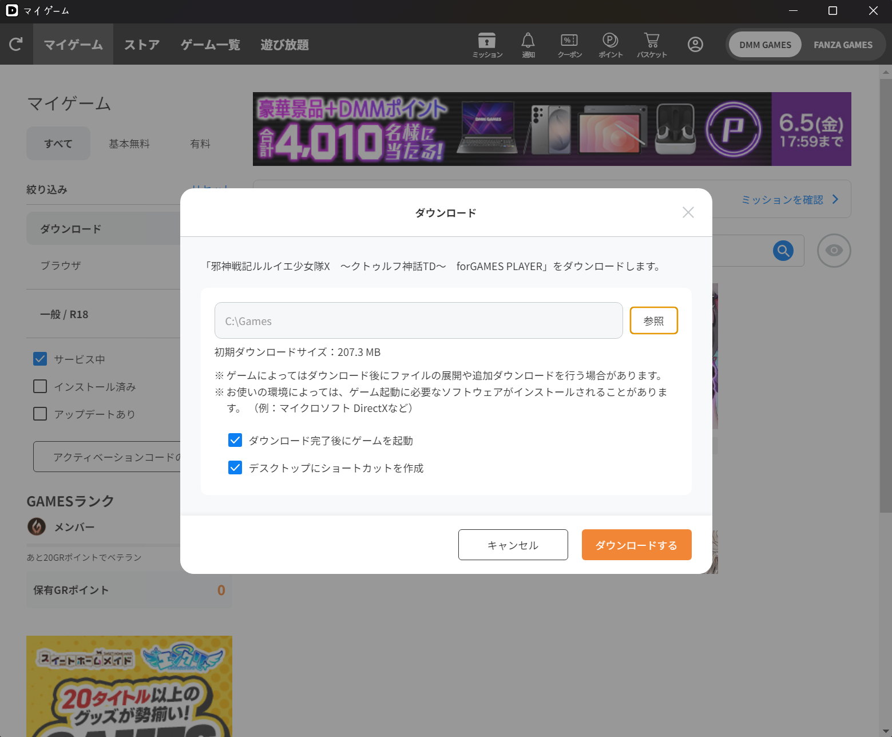
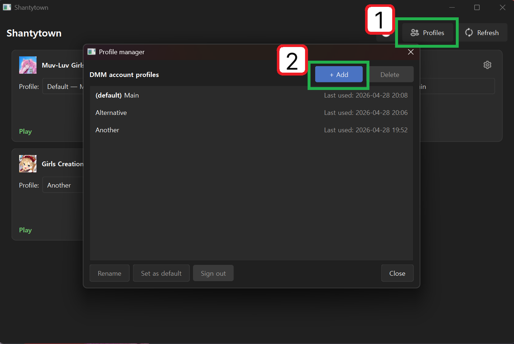
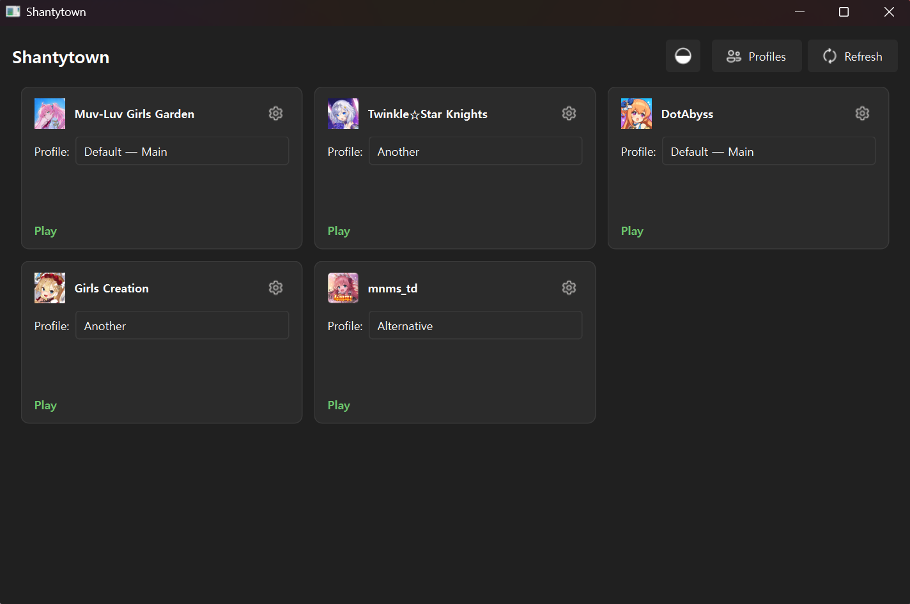
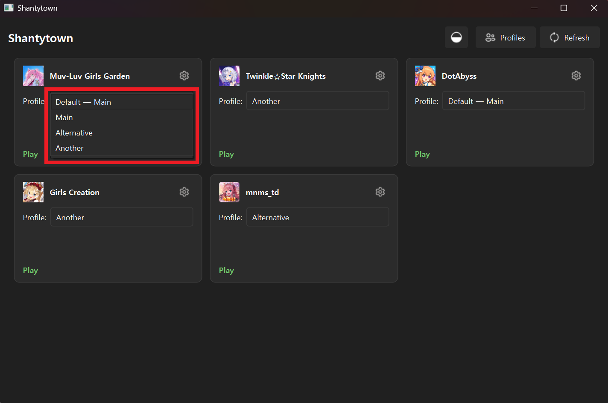
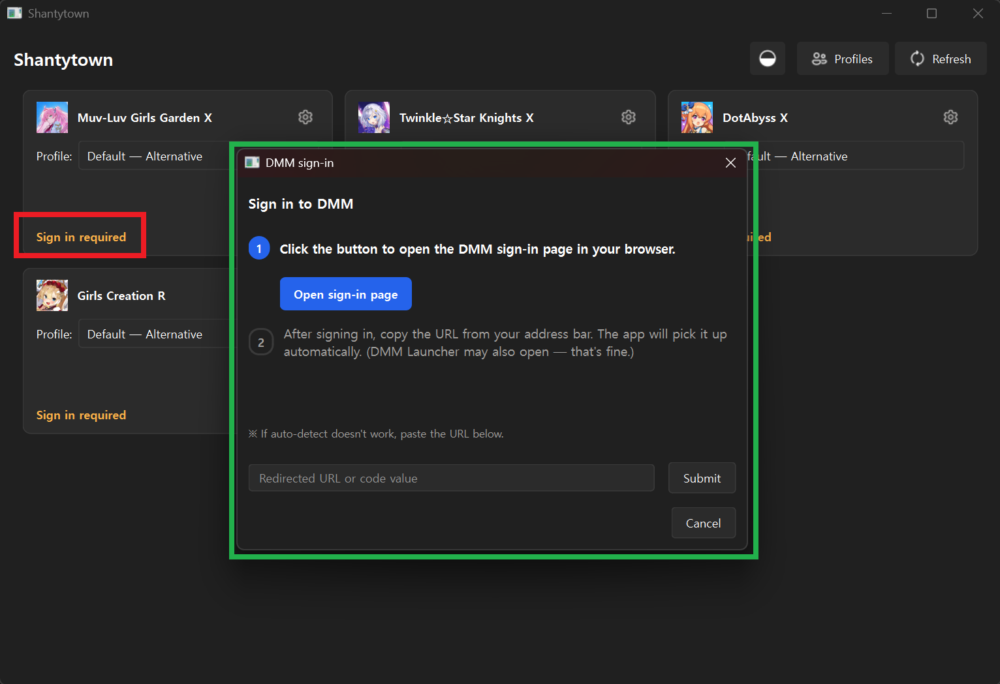

# Shantytown (판자촌)

[한국어](../README.md) · [English](README.en.md) · [简体中文](README.zh-CN.md)

DMM Game Player 的第三方启动器。可为每个已安装游戏指定不同的 DMM 账户（配置文件）。  
已安装的 DMM 游戏可以在日本境外、无需 VPN 直接启动。

## 功能

- 按配置文件分别保存 DMM 账户
- 解析 `dmmgame.cnf`，自动显示已安装的游戏
- 非日本 IP 也能调用 API
- 通过外部浏览器登录 + 剪贴板自动识别
- 通过 DPAPI 加密保存令牌（仅限 Windows）
- 浅色 / 深色 / 跟随系统主题，韩文 / 英文界面
- 单文件 exe 分发

## 使用方式

从 Releases 页面下载最新的 `shantytown.exe`，直接运行即可。

游戏需要事先通过官方 DMM Game Player 安装。本程序仅负责启动已安装的游戏。

## 教程

与首次启动时显示的引导内容相同。

| 步骤 | 截图 |
| --- | --- |
| 1. 安装游戏 |  |
| 2. 创建配置文件 |  |
| 3. 游戏列表 |  |
| 4. 启动 |  |
| 5. DMM 登录 |  |

1. 通过 DMM Game Player 安装所需的游戏。（下载时可能需要 VPN。）
2. 为每个要使用的 DMM 账户创建一个配置文件。
3. 已安装在本机的游戏会自动出现在主界面。
4. 点击游戏卡片即可启动。切换配置文件可以用不同的 DMM 账户启动同一款游戏。
5. 首次使用某个配置文件启动游戏，或令牌过期时，会通过浏览器进行 DMM 登录。（登录时可能需要 VPN。）

---
## 开发环境

Python 3.11+，建议使用 [`uv`](https://docs.astral.sh/uv/)。

```bash
git clone <repo-url>
cd shantytown
uv sync
uv run python -m shantytown
```

## 测试 / 类型检查 / Lint

```bash
uv run pytest -v
uv run mypy src/
uv run ruff check src/ tests/
```

## 构建 exe

```bash
uv sync
uv run python scripts/build_exe.py
# → dist/shantytown.exe
```

构建脚本会把 `app_icon.svg` 渲染为多分辨率 `.ico`，然后通过 PyInstaller 的 `--onefile --windowed` 模式构建。最终产物约 42 MB，自包含。

## 命令行参数

| 参数 | 效果 |
| --- | --- |
| `--debug` | 出错时显示完整响应正文；同时启用 telemetry hook |
| `--locale=ko` / `--locale=en` | 强制 UI 语言。未指定时自动检测系统区域设置 |
| `--show-tutorial` | 强制本次启动显示首次教程（不修改持久化标记） |

其余参数会原样传递给 Qt（例如 `-platform offscreen`）。

## 项目结构

```
src/shantytown/
  core/        # 不依赖 Qt 的纯逻辑：API 客户端、MD5 校验、下载器、
               # DPAPI 封装、telemetry、区域检测
  store/       # 基于 JSON 的持久化：配置文件 / 游戏设置 / 应用设置 / known_games
  gui/         # PyQt6 界面：主窗口、卡片、对话框（登录 / 配置文件 /
               # 游戏设置 / 教程 / 进度）、worker、主题
  resources/   # 打包资源：Fluent UI 图标、教程 PNG、应用图标 SVG
tests/         # 165 个测试
scripts/       # build_exe.py
docs/          # 早期 PowerShell 原型和迭代计划
```

## 注意事项

- 本程序通过非官方途径启动游戏。使用风险由用户自担。

---

整个项目的源代码乃至本 README 均由 [Claude Code](https://claude.com/claude-code) 编写。  
从一份 466 行的 PowerShell 原型出发，GUI / i18n / DPAPI / exe 构建 / 165 个测试全部在同一个聊天会话中完成。人类的工作大致是诸如“这颜色不行”、“这里崩了”、“下一阶段走起”之类的反馈。
